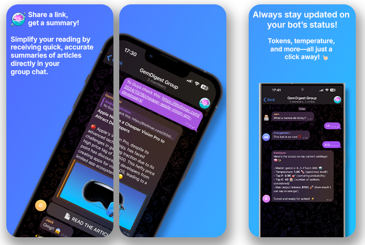

<div id="top"></div>
<br/>
<br/>
<br/>


<p align="center">
  
</p>
<h1 align="center">
    <a href="https://github.com/Armaggheddon/GemDigest">GemDigest</a>
</h1>
<p align="center">
    <a href="https://github.com/Armaggheddon/GemDigest/commits/master">
    
    </a>
    <a href="https://github.com/Armaggheddon/GemDigest">
    
    </a>
    <a href="https://github.com/Armaggheddon/GemDigest/issues">
    
    </a>
    <a href="https://github.com/Armaggheddon/GemDigest/blob/master/LICENSE">
    
    </a>
</p>
<p align="center">
    An awesome telegram bot that summarizes articles for you and your friends.
    <br/>
    <a href="https://github.com/Armaggheddon/GemDigest/issues">Report Bug</a>
    •
    <a href="https://github.com/Armaggheddon/GemDigest/issues">Request Feature</a>
</p>


---


<br/><br/>
<h2 id="itroduction">📔  Introduction</h2>
<h3 align="center">Introducing GemDigest: Your Personal Article Summarizer for Telegram! 📜✨</h3>
<p>
    Are you tired of wading through endless articles filled with redundant information, unclear points, or annoying ads? GemDigest is here to help! This simple yet powerful Telegram bot lets you quickly summarize articles from various websites, giving you a clear and concise summary in just a few sentences.
</p>
<p>
    Whether you’re chatting one-on-one or in a group, GemDigest works seamlessly in the background. We all have that friend who loves to share links to articles and websites, but let’s face it—sometimes there’s just not enough time to read them all. With GemDigest, simply paste the link into the chat, and the bot will automatically generate a summary for you, saving you time and energy. No extra commands to memorize, no complicated steps involved—just share the link, and let the magic happen! 🧙‍♂️✨ The bot will recognize the links and reply with a summary, while ignoring any non-link messages to keep your conversations flowing smoothly. 💬🔗
</p>
<br/>
<p align="center">
    
</p>
</br>

<h3 align="center">Powered by Google Gemini 🚀</h3>
</br>
</br>
<p align="center">
    
</p>
<p>
    GemDigest uses the power of Google’s Gemini API, so you don’t need any specialized or high-performance hardware to enjoy this feature. All the heavy lifting is done by Google’s servers, meaning the bot is fast, reliable, and doesn’t require any expensive infrastructure on your end. 💡 The best part? The Google Gemini API is completely free (with some limitations), so you won’t have to spend a cent! 💰
</p>
<p>
    With GemDigest, say goodbye to lengthy articles and hello to quick, easy-to-read summaries! Save time, stay informed, and focus on what really matters.
</p>
<br/>


<h2 id="made-in"><br/>🛠  Built in</h2>
<p>
    This project is entirely written in Python and uses Crawl4AI in conjunction with the Google Gemini API for summarizing articles from the links provided. It also uses the Telegram API for sending the digests to the users.
</p>
<br/>
<div align="center"> 
    <a href="https://www.python.org">Python</a> • 
    <a href="https://ai.google.dev/gemini-api/?utm_source=google&utm_medium=cpc&utm_campaign=core-brand-eur-sem&utm_id=21341690381&gad_source=1&gbraid=0AAAAACn9t64XUQZ4y0dYpRDad6aQAfSBp&gclid=CjwKCAjwjsi4BhB5EiwAFAL0YKWC3RF9GuUdj2urhHRIAbN7axXPEwk3jRiecBGQ5brJ7W4-6ammvRoCw_0QAvD_BwE">Google Gemini API</a> • 
    <a href="https://github.com/unclecode/crawl4ai">Crawl4AI</a> • 
    <a href="https://github.com/eternnoir/pyTelegramBotAPI">Telegram API</a>
</div>

<p align="right"><a href="#top">⇧</a></p>

<h2 id="documentation"><br/><br/>📚  Documentation</h2>
<p>
    Here you can find the documentation for the GemDigest bot. This documentation provides detailed information on how to use and the different commands and options available to users. It also includes installation instructions, prerequisites, and other essential details to help you get started with the bot.
</p>
<p>
    You can find all the informations at: <a href="docs.md">Documentation »</a>
</p>


<p align="right"><a href="#top">⇧</a></p>


<h2 id="prerequisites"><br/>🧰  Prerequisites</h2>
<p>
    The GemDigest bot can be installed in several ways:
    <ul>
        <li>Directly using Python with <code>venv</code> and <code>pip</code></li>
        <li>With Docker</li>
        <li>Using Docker Compose</li>
    </ul>
    Additionally, if you are using <a href="https://casaos.zimaspace.com"><strong>CasaOS</strong></a>, you can easily install the precompiled build by using the  <a href="https://github.com/Armaggheddon/GemDigest/blob/main/casaos-docker-compose.yml"><code>casaos-docker-compose.yml</code></a> file provided. This option simplifies the setup, particularly for users of CasaOS who want a streamlined installation process.
</p>
<p>
    Before proceeding with the installation, there are a few prerequisites you will need:
    <ul>
        <li><strong>A Telegram bot token</strong>. You can obtain this token by contacting <a href="https://telegram.me/BotFather" target="_blank">@BotFather</a> on Telegram and following the instructions. This token is essential for enabling the bot's communication through Telegram.</li>
        <li><strong>A Google Gemini API key</strong>. This key is necessary for the bot to access and process data using Google Gemini's services. You can obtain the key by creating one through the following link: <a href="https://aistudio.google.com/app/apikey" target="_blank">Google Gemini API Key</a>. Note that there is a free version available with certain limitations, but it should be sufficient for the bot's basic functionalities.</li>
    </ul>
</p>
<p>
    If you plan to run the bot with Python or Docker (outside of CasaOS), you'll need to ensure that both <strong>Python</strong> and <strong>Docker</strong> are installed on your system. Python will be used for executing the bot's code and managing dependencies, while Docker allows for containerized deployment, simplifying the environment setup.
</p>
<p>
    For CasaOS users, these additional prerequisites are not required since the platform handles much of the complexity internally, offering a smoother installation experience.
</p>
<p>
    Once you have these prerequisites ready, you can proceed with the installation method that best suits your environment. Whether you prefer running the bot locally with Python, inside a container with Docker, or using CasaOS for an even simpler setup, the flexibility of this bot ensures it can fit your needs.
</p>

<p align="right"><a href="#top">⇧</a></p>


<h2 id="how-to-start"><br/>⚙️  How to Start</h2>
<p>
    Based on the prerequisites you have, you can choose the installation method that best suits your needs. Below are the steps for setting up the GemDigest bot using Python, Docker, Docker Compose, or CasaOS. Follow the instructions for the method you prefer to get the bot up and running quickly.
</p>

<h3>  Python </h3>

1. Clone the repo
  
    ```bash
    git clone https://github.com/Armaggheddon/GemDigest.git
    ```

2. enter the directory

    ```bash
    cd GemDigest
    ```

3. Create the Venv and Install the dependencies
    
    ```bash
    python3 -m venv env
    source venv/bin/activate
    pip install -r requirements.txt
    ```

4. Install Playwright and dependencies

    ```bash
    pip install --no-cache-dir playwright && playwright install && playwright install-deps
    ```

5. Add the API Keys to the environment variables

    ```bash
    export TELEGRAM_API_KEY=YOUR_TELEGRAM_API_KEY
    export GEMINI_API_KEY=YOUR_GEMINI_API_KEY
    export ADMIN_ID=YOUR_ADMIN_ID
    ```

    For example:
    
    ```bash
    export TELEGRAM_API_KEY=1234567890:ABCDEF
    export GEMINI_API_KEY=1234567890:ABCDEF
    # If you have more than one admin, separate the IDs with a ";"
    export ADMIN_ID=1234;5678
    ```


<h3>  Docker </h3>

1. Create a copy of the file `api_keys.env.example` and rename it to `api_keys.env`


2. Add the API Keys to the `api_keys.env` file

    ```bash
    TELEGRAM_API_KEY=1234567890:ABCDEF
    GEMINI_API_KEY=1234567890:ABCDEF
    # If you have more than one admin, separate the IDs with a ";"
    ADMIN_ID=1234;5678
    ```

3. Build the container

    ```bash
    docker build -t gem_digest_bot .
    ```

4. Start the container

    ```bash
    docker run -d --env-file api_keys.env --name gem_digest_bot gem_digest_bot
    ```

5. **(OPTIONAL)** Add blacklist for websites to crawl:
    - Edit the file in [`extra_configs/website_blacklist.txt`](../extra_configs/website_blacklist.txt) adding your websites to blacklist
    - Mount the file in the container (use this command instead of the one at step `4`)
        ```bash
        docker run -d --env-file api_keys.env --name gem_digest_bot -v $(pwd)/extra_configs:/gem_digest_bot/extra_configs gem_digest_bot
        ```

<h3>  Docker Compose </h3>

1. Create a copy of the file `api_keys.env.example` and rename it to `api_keys.env`


2. Add the API Keys to the `api_keys.env` file

    ```bash
    TELEGRAM_API_KEY=1234567890:ABCDEF
    GEMINI_API_KEY=1234567890:ABCDEF
    # If you have more than one admin, separate the IDs with a ";"
    ADMIN_ID=1234;5678
    ```

3. Build the container

    ```bash
    docker compose -f docker-compose.yml build
    ```

4. Start the container

    ```bash
    docker compose -f docker-compose.yml up -d
    ```

5. **(OPTIONAL)** Add blacklist for websites to crawl by editing the file in [`extra_configs/website_blacklist.txt`](../extra_configs/website_blacklist.txt). Then restart the compose with the following command:
    ```bash
    docker compose -f docker-compose restart
    ```

<h3>  CasaOS </h3>
<ul>
    <li>Add the <code><a href="https://awesome.casaos.io/content/3rd-party-app-stores/list.html#_6-big-bear-casaos-app-store">BigBearCasaOS</a></code> to the store</li>
    <li>Download <code>GemDigest</code> from the Store</li>
    <li>Open the Settings of the app</li>
    <li>Add your <code>Telegram API Key</code>, <code>Gemini API Key</code> and the <code>Admin ID</code> (If you have more user add the diferent ID's separated by a <code>";"</code>)</li>
</ul>
<!-- <ul>
    <li>Open your casaOS page and go to the <code>+</code></li>
    <li>Click on <code>Install a costumized app</code></li>
    <li>Click on the <code>import</code> icon (on the top right)</li>
    <li>Drag and Drop the <a href="https://github.com/Armaggheddon/GemDigest/blob/main/casaos-docker-compose.yml"><code>casaos-docker-compose.yml</code></a> file</li>
    <li>Click on <code>Submit</code></li>
    <li>Add your <code>Telegram API Key</code>, <code>Gemini API Key</code> and the <code>Admin ID</code> (If you have more user add the diferent ID's separated by a <code>";"</code>)</li>
</ul> -->

<p align="right"><a href="#top">⇧</a></p>

---

<h3 id="responsible-disclosure"><br/>📮  Responsible Disclosure</h3>
<p>
    We assume no responsibility for an improper use of this code and everything related to it. We do not assume any responsibility for damage caused to people and / or objects in the use of the code.
</p>
<strong>
    By using this code even in a small part, the developers are declined from any responsibility.
</strong>
<br/>
<br/>
<p>
    It is possible to have more information by viewing the following links: 
    <a href="#license"><strong>License</strong></a>
</p>

<p align="right"><a href="#top">⇧</a></p>


<h3 id="report-a-bug"><br/>🐛  Bug and Feature</h3>
<p>
    To <strong>report a bug</strong> or to request the implementation of <strong>new features</strong>, it is strongly recommended to use the <a href="https://github.com/Armaggheddon/GemDigest/issues"><strong>ISSUES tool from Github »</strong></a>
</p>
<br/>
<p>
    Here you may already find the answer to the problem you have encountered, in case it has already happened to other people. Otherwise you can report the bugs found.
</p>
<br/>
<strong>
    ATTENTION: To speed up the resolution of problems, it is recommended to answer all the questions present in the request phase in an exhaustive manner.
</strong>
<br/>
<br/>
<p>
    (Even in the phase of requests for the implementation of new functions, we ask you to better specify the reasons for the request and what final result you want to obtain).
</p>
<br/>
<br/>

<p align="right"><a href="#top">⇧</a></p>

 --- 

<h2 id="license"><br/>🔍  License</h2>
<strong>MIT LICENSE</strong>
<br/>
<br/>
<i>Permission is hereby granted, free of charge, to any person obtaining a copy
of this software and associated documentation files (the "Software"), to deal
in the Software without restriction, including...</i>
<br/>
<br/>
<a href="https://github.com/Armaggheddon/GemDigest?tab=MIT-1-ov-file">
    <strong>License Documentation »</strong>
</a>
<br/>
<p align="right"><a href="#top">⇧</a></p>


<h3 id="third-party-licenses"><br/>📌  Third Party Licenses</h3>

In the event that the software uses third-party components for its operation, 
<br/>
the individual licenses are indicated in the following section.
<br/>
<br/>
<strong>Software list:</strong>
<br/>
<table  align="center">
  <tr  align="center">
    <th>Software</th>
    <th>License owner</th> 
    <th>License type</th> 
    <th>Link</th>
  </tr>
  <tr  align="center">
    <td>Crawl4AI (Async Version)</td>
    <td><a href="https://github.com/unclecode">unclecode</a></td>
    <td>Apache-2.0 license</td>
    <td><a href="https://github.com/unclecode/crawl4ai">here</a></td>
  </tr>
  <tr  align="center">
    <td>Gemini</td> 
    <td><a href="https://ai.google.dev/aistudio">Google</a></td>
    <td></td>
    <td><a href="https://ai.google.dev/gemini-api/docs">here</a></td>
  </tr>
  <tr  align="center">
    <td>pyTelegramBotAPI</td>
    <td><a href="https://github.com/eternnoir">eternnoir</a></td>
    <td>GPL 2.0 license</td>
    <td><a href="https://github.com/eternnoir/pyTelegramBotAPI">here</a></td>
  </tr>
</table>

<p align="right"><a href="#top">⇧</a></p>


---
> *<p align="center"> Copyrright (C) by Brunello Alessandro & Pietrobon Andrea <br/> Released date: 20-10-2024*