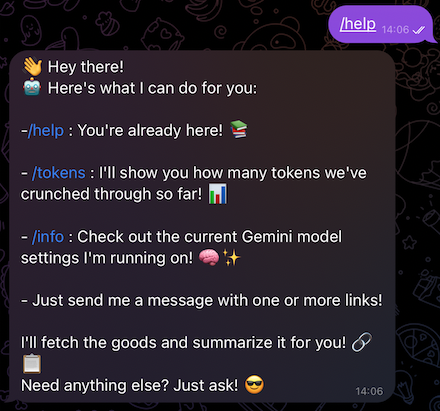
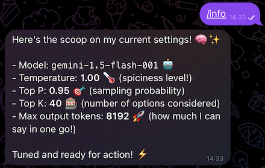
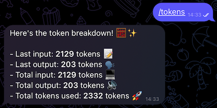
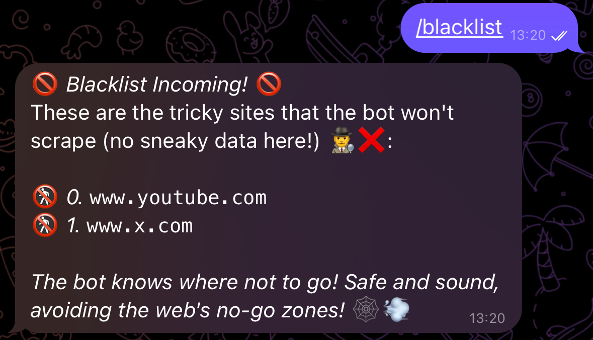

<h1 id="documentation">  📚  Documentation</h1>
<h3 id="documentation">   GEMINI</h3>

    The bot is highly customizable 🤖, allowing you to adjust the prompt according to your needs, resulting in more personalized responses ✍️. You can also configure various settings ⚙️, such as the model and the temperature, depending on the context or the type of output you want to generate.

    By default, the following parameters are set:

<ul>
    <li><strong>Model:</strong> gemini-1.5-flash-001 🧠</li>
    <li><strong>Temperature:</strong> 1 🌡️</li>
    <li><strong>Top P:</strong> 0.95 🎯</li>
    <li><strong>Top K:</strong> 40 📊</li>
    <li><strong>Max Output Tokens:</strong> 8192 📄</li>
    <li><strong>Response Mime Type:</strong> application/json 📙</li>
</ul>

    You can modify these parameters to suit your specific needs, such as increasing the temperature for more creative responses 🎨 or lowering it for more deterministic outputs ✅. Similarly, Top P, Top K, and Top N can be adjusted to control how broad or narrow the selection of possible next tokens should be during generation.

<h3 id="documentation"> 🕷️🤖  CRAWLER</h3>

> [!NOTE]  
> Currently, it is not possible to set custom parameters for the crawler 🚧.

    The crawler operates with a fixed configuration designed to efficiently retrieve and process data 📂, but future updates may include options for more granular control ⚙️, such as setting intervals ⏲️ or data extraction rules 📋.

<h3 id="documentation"> 🧑‍🧑‍🧒‍🧒  USERS & GROUPS</h3>

    In terms of user interaction, the bot can be set up to interact either with individual users 👤 or with users within groups 👥. This allows for flexible engagement depending on your needs.

    For example, if you set <code>ADMIN_USER_ID=123</code> where <code>123</code> is the user's ID, the bot will be able to interact with this specific user through a private chat 💬. If you wish to allow multiple users to interact with the bot in separate private chats, you can simply add their IDs, like so: <code>ADMIN_USER_ID=123;456</code>. This way, each user will have the ability to privately communicate with the bot 👥💬.

    If you want the bot to interact with users in a group, simply add the bot to the desired group and set <code>ADMIN_USER_ID=-100789</code>, where <code>-100789</code> represents the group ID 🛠️.

> [!NOTE]  
> To get a user’s ID, follow this guide 📝: [whoami_bot](https://github.com/Armaggheddon/whoami_bot)
> To get a group’s ID, use this guide 📝: [Group ID](https://stackoverflow.com/a/72649378/8723227)

> [!TIP]
> Additionally, it is possible to enable both private chats with the bot and group interactions simultaneously by setting `ADMIN_USER_ID` as follows: `ADMIN_USER_ID=123;567;-100789`. In this case, the bot will be able to engage with users in private chats as well as in the specified group 🗣️👥.

    With this flexible setup, you can fine-tune how the bot communicates 📞, whether for one-on-one interactions or group-wide discussions 🗨️💡.

<h3 id="documentation"> 📋 DEFAULT COMMANDS</h3>

    You can use the following predefined commands to get information about the bot's functionalities:

<ul>
    <li><strong>/help:</strong> Returns a list of available commands 📜</li>
    <li><strong>/tokens:</strong> Returns the number of tokens used 🔢</li>
    <li><strong>/info:</strong> Returns information such as the current temperature and the model being used 📊</li>
    <li><strong>/blacklist:</strong> Returns the list of website for which the summary is not needed (e.g. youtube) 📊</li>
</ul>

    Examples of the following commands are provided in the table below:

<table>
<tr>
    <th>Command</th>
    <th>Description</th>
    <th>Image</th>
</tr>
<tr>
    <td><code>/help</code></td>
    <td>Displays a list of all available commands, helping you explore the bot's features more easily 🛠️</td>
    <td></td>
</tr>
<tr>
    <td><code>/tokens</code></td>
    <td>Shows the number of tokens used so far, helping to keep track of the token consumption efficiently 🔍</td>
    <td></td>
</tr>
<tr>
    <td><code>/info</code></td>
    <td>Provides details about the current bot configuration, including temperature, model, and other settings ⚙️</td>
    <td></td>
</tr>
<tr>
    <td><code>/blacklist</code></td>
    <td>Provides the list of websites where summaries are not needed, such as YouTube ⛔</td>
    <td></td>
</tr>
</table>
